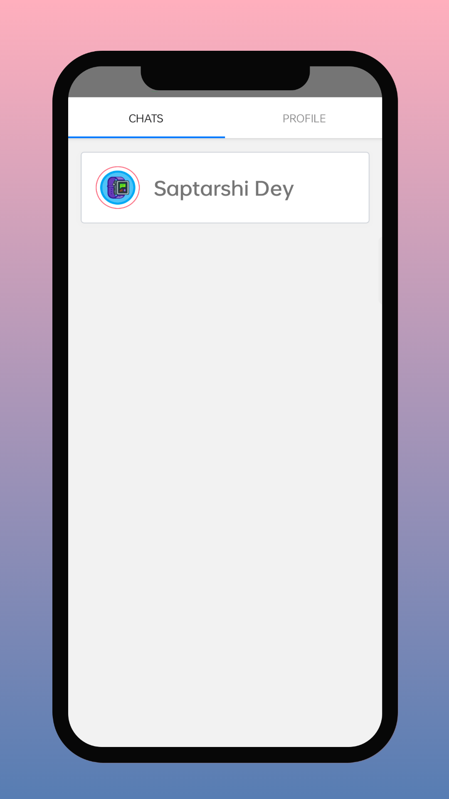

# React Native Firebase Chat Application

Internally, we use RN Firebase, Gifted Chat, and Notifee to streamline our processes.

### Application Screenshots

| Image 1               | Image 2               | Image 3               |
|-----------------------|-----------------------|-----------------------|
|   |   |   |

| Image 4               | Image 5               | Image 6               |
|-----------------------|-----------------------|-----------------------|
|   |   |   |

# Getting Started

>**Note**: Make sure you have completed the [React Native - Environment Setup](https://reactnative.dev/docs/environment-setup) instructions till "Creating a new application" step, before proceeding.

## Step 1: Start the Metro Server

First, you will need to start **Metro**, the JavaScript _bundler_ that ships _with_ React Native.

To start Metro, run the following command from the _root_ of your React Native project:

```bash
# using npm
npm start

# OR using Yarn
yarn start
```

## Step 2: Start your Application

Let Metro Bundler run in its _own_ terminal. Open a _new_ terminal from the _root_ of your React Native project. Run the following command to start your _Android_ or _iOS_ app:

### For Android

```bash
# using npm
npm run android

# OR using Yarn
yarn android
```

### For iOS

```bash
# using npm
npm run ios

# OR using Yarn
yarn ios
```

If everything is set up _correctly_, you should see your new app running in your _Android Emulator_ or _iOS Simulator_ shortly provided you have set up your emulator/simulator correctly.

This is one way to run your app — you can also run it directly from within Android Studio and Xcode respectively.

## Step 3: Modifying your App

Now that you have successfully run the app, let's modify it.

1. Open `App.tsx` in your text editor of choice and edit some lines.
2. For **Android**: Press the <kbd>R</kbd> key twice or select **"Reload"** from the **Developer Menu** (<kbd>Ctrl</kbd> + <kbd>M</kbd> (on Window and Linux) or <kbd>Cmd ⌘</kbd> + <kbd>M</kbd> (on macOS)) to see your changes!

   For **iOS**: Hit <kbd>Cmd ⌘</kbd> + <kbd>R</kbd> in your iOS Simulator to reload the app and see your changes!

## Step 4: Set Configuration File

1. Create a `config.ts` file in root directory.
2. Open `config.example.ts` & copy code from this file.
3. Past `config.ts` the code inro `config.ts` file.
4. Set your Keys here.

## Step 5: Add google service file

1. Create a project into firebase console.
2. Download `google-service.json` file and past it into `android\app` folder.

## Congratulations! :tada:

Welcome to Firebase Chat App. :partying_face:


<p align="center">
  Made By <a href="https://github.com/SaptarshiDy" target="_blank">Saptarshi Dey</a>
</p>
